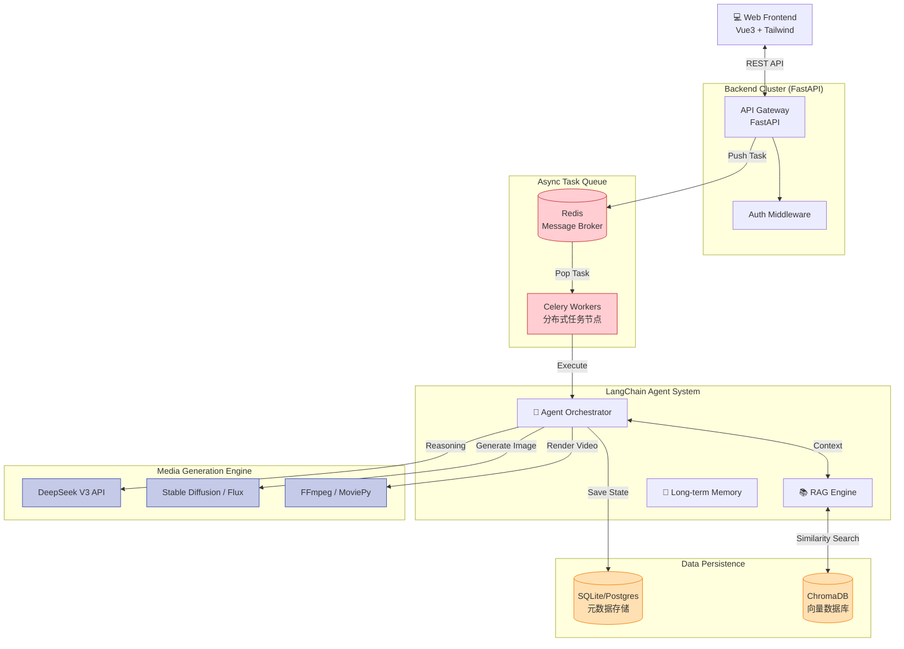

# Auto-Media-Agent (全自动 AI 媒体矩阵系统)

这是一个基于 Agent 的全自动 AI 媒体内容生产系统。它能够自动抓取新闻、进行 AI 深度调研、生成多风格文案，并最终合成短视频进行全平台分发。

## 🏗 System Architecture (系统架构)

### 1. 业务流程图 (Business Flow)

```mermaid
graph LR
    %% 定义样式
    classDef input fill:#e1f5fe,stroke:#01579b,stroke-width:2px;
    classDef process fill:#fff9c4,stroke:#fbc02d,stroke-width:2px;
    classDef output fill:#e8f5e9,stroke:#2e7d32,stroke-width:2px;

    %% 节点定义
    User((用户/定时任务))
    subgraph Input [数据输入层]
        RSS[RSS 订阅源]
        Search[Google/Serper 搜索]
    end

    subgraph Brain [AI 处理核心]
        Researcher[🕵️ 调研 Agent]
        Writer[✍️ 编辑 Agent]
        Director[🎬 导演 Agent]
    end

    subgraph Media [多模态生成工厂]
        ImgGen[🎨 Flux/SD 绘图]
        VidGen[🎥 FFmpeg 视频合成]
        TTS[🔊 Edge-TTS 配音]
    end

    subgraph Channel [分发渠道]
        WeChat[📱 微信推送]
        Web[🌐 Web 前端展示]
        Social[🔥 小红书/推特]
    end

    %% 连线关系
    User -->|触发| Input
    Input -->|原始信息| Researcher
    Researcher -->|清洗后数据| Writer
    Writer -->|文案脚本| Director
    Director -->|绘画提示词| ImgGen
    Director -->|字幕与配音| TTS
    ImgGen & TTS -->|素材| VidGen
    VidGen -->|成品视频| Channel
    Writer -->|图文内容| Channel

    %% 应用样式
    class RSS,Search input;
    class Researcher,Writer,Director process;
    class WeChat,Web,Social output;
```



### 2. 技术架构图 (Tech Stack)




# 🚀 Auto-Media-Agent (AMA)
**An Enterprise-Grade Autonomous Multi-Modal Rendering Engine**


## 📖 项目愿景 (Project Vision)
Auto-Media-Agent (AMA) 是一个全自动的 AI 多模态内容生成矩阵系统。它突破了传统 AIGC 工具需要频繁人工介入的限制，构建了一条从**全网情报实时抓取 -> 动态 RAG 记忆检索 -> LLM 深度创作 -> TTS 音频合成 -> FLUX 视觉生成 -> Whisper 像素级音画字同步 -> 终极视频压制**的全自动 DAG (有向无环图) 工业流水线。

系统采用前后端分离架构，底座依托 Redis + Celery 实现异步高并发调度，专为多模态计算密集型任务打造。


## ✨ 核心特性与工程突破 (Core Engineering Breakthroughs)

本系统不仅是各种 API 的简单堆砌，而是深入解决了一系列多模态视频工程与底层并发领域的“深水区”难题：

### 1. 🎞️ 像素级音画字精准同步 (Pixel-Level Subtitle Injection)
* **痛点**：传统视频渲染库（如 MoviePy）在 Windows 环境下处理带透明通道（Alpha Mask）的复杂字幕图层时，极易出现底层 C 语言级的遮罩丢失 Bug。
* **架构解法**：彻底重构渲染逻辑，引入 `faster-whisper` 进行毫秒级音频切片（Audio Slicing）。废弃传统的“图层叠加”方案，自主研发基于 Pillow 和 `fl_image` 的**帧级像素重绘引擎 (Frame-Level Rendering)**，直接在视频基底的每一帧 RGB 像素矩阵上硬编码字幕，实现了 100% 绝对可靠的音画字对齐。

### 2. ⚡ 分布式高并发死锁免疫 (Concurrency Deadlock Resolution)
* **痛点**：在引入 LangChain 等现代异步框架（Asyncio）时，极易与传统的协程池（如 Gevent/Eventlet）在底层套接字上发生争用，导致系统产生灾难性的并发死锁（Deadlock）。
* **架构解法**：实施严格的“异步隔离策略”。在 Celery 任务节点中启用 Python 原生多线程池（Threads Pool），并利用独立的事件循环（Event Loop）来挂载大模型的异步链调用（`ainvoke`）。使得系统能够无阻塞地同时处理多个视频渲染订单。

### 3. 🧠 具备时间钢印的动态 RAG 记忆流 (Time-Aware Dynamic RAG)
* **设计**：彻底摒弃静态本地数据库。系统集成 DuckDuckGo 实时搜索引擎，并在每一次生成任务启动时，向 Agent 注入当前真实世界的“时间钢印”。搜集到的情报不仅用于当前分析，还会被向量化存入 ChromaDB，为未来的任务提供长期的历史上下文支撑。

## 🛠️ 技术栈矩阵 (Tech Stack)

| 领域 (Domain) | 核心技术 (Technologies) |
| :--- | :--- |
| **AI & LLM Base** | LangChain (LCEL), DeepSeek V3, DuckDuckGo Search |
| **Multi-Modal Engine**| FLUX (Image Gen), Edge-TTS (Audio), Faster-Whisper (ASR), MoviePy (Video) |
| **Vector & Storage** | ChromaDB (RAG), SQLite (Meta), Redis (Message Broker) |
| **Backend & Queue** | FastAPI (ASGI), Celery (Distributed Task Queue) |
| **Frontend UI** | Vue3, TailwindCSS, Canvas Particle Physics Engine |

## ⚙️ 系统标准作业流程 (SOP Workflow)
1. `Data Mining`: 接收指令，连接公网搜索引擎获取最新资讯。
2. `Memory Retrieval`: 在 ChromaDB 中进行语义检索，提取历史关联记忆。
3. `LLM Reasoning`: 融合实时数据与历史记忆，生成带有情绪色彩的脚本和视觉分镜提示词。
4. `Assets Generation`: 并行调用 TTS 与生图大模型，生成音视觉原始素材。
5. `Timeline Alignment`: 唤醒 Whisper 听写引擎，生成带有精准时间戳（Timestamps）的字幕轨。
6. `Video Composition`: 启动视频压制引擎，进行像素级合并与输出，并通过长轮询（Polling）将媒体资产推送到前端控制台。

## 🚀 快速启动 (Quick Start)

**1. 克隆仓库**
```bash
git clone [https://github.com/your-username/Auto-Media-Agent.git](https://github.com/your-username/Auto-Media-Agent.git)
cd Auto-Media-Agent
